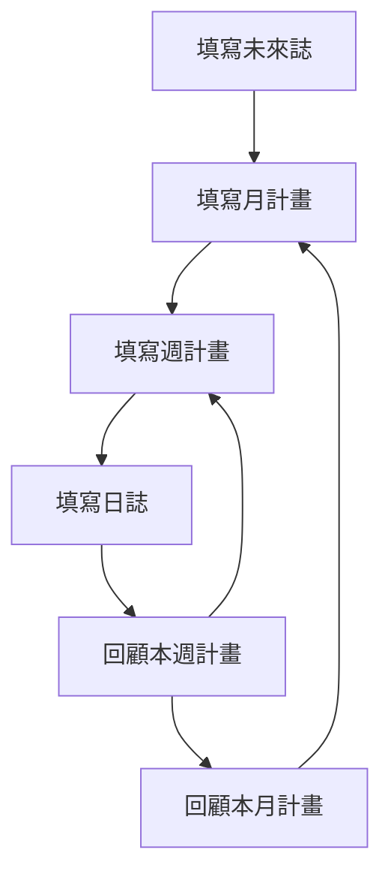

---
---

## Key 撰寫體例
-  : 一般筆記，生活記錄，帳目
💊 : 計畫的任務，在未來誌, 月計畫, 週計畫中的工作
- [ ] : 待辦工作，在日誌中的工作
📅 : 事件
⭐ : 重要性 
➡️ : 延後一天
⬅️ : 轉移到上一層清單

## 檔案架構與關聯
- Future Log 未來誌(年度記事)
	- 當得知未來發生的任務或行程，可以先填寫在未來誌裡。
	- 日後進行每月、每週計畫時可參考與引用。
	- 儲存目錄 : __14 Yearly__
	- Key 僅包括 : 💊 📅

- Monthly Log 月計畫
	- 每月1~2日進行月計畫，參考 Future Log 並回顧上個月計畫，轉移預計執行的任務至 __本月計畫__ 區段。
	- 當任務完成後，不希望繼續顯示在週計畫、日誌中，可以轉移至 __本月完成__ 區段。
	- 儲存目錄 : __13 Monthly__
	- Key 僅包括 : 💊 📅

- Weekly Log 週計畫
	- 每週日進行本週計畫，參考月計畫並回顧上週計畫，轉移預計執行的任務至 __本週計畫__ 區段。
	- 當任務完成後，不希望繼續顯示在日誌中，可以轉移至 __本週完成__ 區段。
	- 儲存目錄 : __12 Weekly__
	- Key 僅包括 : 💊 📅

- Daily Log 日誌
	- Daily Log 日誌 : 參考週計畫並回顧年一天的日誌，轉移預計執行的任務至此區段。
	- Routine : 每天例行事項，當天沒做完不轉移至明天。
	- Daily Review : 將今天 Daily Log 未完成的任務標示 ➡️ 並轉移過來此區段
	- Reminder : 透過連結自動顯示前一天的 Daily Review、本週計畫、本月計畫、未來誌
	- 儲存目錄 : __11 Daily__

## 流程步驟

