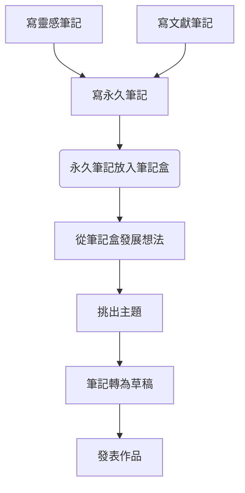

# 字體

```
這是 *斜體*
這是 **粗體**
==highlight==
```

這是 *斜體*
這是 **粗體**
這是 ==highlight==

---
# Checkbox
- [ ] 項目 A
- [X] 項目 B

---
# 引用素材

字首加 ! 
字尾加 |300 表示寬度 300px
```
![[Pasted image 20221221142258.png]]
![[Pasted image 20221221142258.png|300]]
```

呈現

![[Pasted image 20221221142258.png]]

![[Pasted image 20221221142258.png|300]]
---
# [iframe 範例](https://help.obsidian.md/How+to/Embed+files#iframe)
內塹 Twitter 訊息

```
<iframe border=0 frameborder=0 height=800 width=600 src="https://twitframe.com/show?url=https://twitter.com/robinliks/status/1597095393870823424"> </iframe>
```

呈現
<iframe border=0 frameborder=0 height=800 width=600 src="https://twitframe.com/show?url=https://twitter.com/robinliks/status/1597095393870823424"> </iframe>

---
# 流程圖

語法
[Flowcharts - Basic Syntax | Mermaid](https://mermaid.js.org/syntax/flowchart.html)

```
mermaid 
graph TD

    1[寫靈感筆記] --> 3

    2[寫文獻筆記] --> 3

    3[寫永久筆記]

    --> 4(永久筆記放入筆記盒)

    --> 5[從筆記盒發展想法]

    --> 6[挑出主題]

    --> 7[筆記轉為草稿]
    
    --> 8[發表作品]
```

呈現


---
# 參考資料
[Format your notes - Obsidian Help](https://help.obsidian.md/How+to/Format+your+notes)


